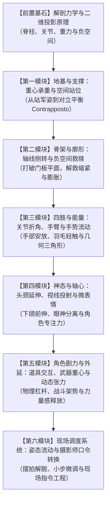

# 人物姿态、重心与角色动作：全阶摄影课程大纲

## 0. 课程设计哲学与分层标准

本课程面向已有一定实拍经验的 Cosplay、漫展场照与人像摄影爱好者。课程目标是帮助学习者**建立基于解剖力学、二维视觉投影与角色叙事的独立摄影判断力**，而非死记硬背体式模板。

课程将知识点严格划分为四种属性，杜绝将个人偏好包装为普遍法则：
- **【原理】摄影原理（Physics & Perception）**：光学、生理力学与二维投影的必然规律（如：大臂压迫躯干必然导致视觉横向变粗与腰线消失；双脚均分承重必然使脊柱垂直僵硬）。
- **【经验】摄影师经验（Practitioner Experience）**：资深从业者在特定情境下的有效技法（如：Roberto Valenzuela 的非对称主承重与负空间启发；まめまよ的长柄武器反向重心代偿）。
- **【教学】项目教学设计（Pedagogical Exercise）**：为帮助学习者内化技能而设计的阶梯练习与自检步骤（如：三点连线检查法、现场单变量对比自拍）。
- **【审美】审美选择（Aesthetic Choice）**：取决于角色人设与创作意图的风格化取舍（如：进攻角色的张扬外扩 vs 受挫角色的防卫内收；高冷微仰视 vs 温柔微俯视）。

---

## 1. 课程全景模块与递进逻辑

---

## 2. 详细章节规划与技能树映射

### 模块 0：前置基石——解剖力学与二维投影原理
*解决认知误区：为什么真人看着挺好，拍进照片却变形局促？*
- **0.1 三维人体在二维画面的几何投影**【原理】
  - 透视收缩（Foreshortening）的生理陷阱：当四肢或武器正冲镜头时发生的肢体截断与轴向压缩效应；
  - 剪影可读性（Silhouette Readability）：优秀姿态在纯黑剪影下的意图辨识度。
- **0.2 舒适度、物理限制与合作伦理基线**【经验/教学】
  - 示范代替接触（Demonstrate without Contact）：严禁擅自动手掰动被摄者；
  - 衣装与活动极限前置询问（Movement Limits Check）：铠甲、绑带、假发的物理活动范围确认。
  - *映射现有技能*：`posing-demonstrate-without-contact`, `posing-movement-limits-check`, `field-cosplay-collaboration`, `field-direction-comfort`

---

### 模块 1：地基与支撑——重心承重与空间站位
*解决核心问题：为什么人物站姿像“站军姿”、松垮或缺乏重心？*
- **1.1 重心均分 vs 单腿主承重（非对称承重经验启发）**【原理/经验】
  - 双腿等重对脊柱的力学锁死机制；
  - 单腿承重如何通过骨盆倾斜激活脊柱自然曲线（Contrapposto 对立平衡）；
  - 适用条件与边界：人像静止站姿偏向 70%~90% 单腿主承重，而动态弓步与搏击架势则需保留后腿蹬力（约 60/40 或 70/30），切忌机械套用。
  - *映射现有技能*：`posing-weight-transfer`, `posing-current-natural-position`
- **1.2 前后腿承重分叉与气势转换**【经验/审美】
  - 前腿承重（逼近感、敏锐、进攻态）vs 后腿承重（从容、防御、审视、帅气拉开距离）；
  - 宽步幅（Stride Width）对角色力量感与稳定性的力矩支持。
  - *映射现有技能*：`posing-front-back-weight-variation`, `posing-action-stance-context`
- **1.3 环境支撑面的借力：倚靠与坐姿解脱**【经验/教学】
  - 墙面、栏杆、台阶的重力分担；高脚椅坐姿下的非对称双腿延伸与防挤压。
  - *映射现有技能*：`posing-supported-lean`, `posing-seated-entry`

---

### 模块 2：骨架与廓形——轴线侧转与负空间救赎
*解决核心问题：为什么人物显得宽大笨重、缩成一团、缺乏腰身与立体感？（本期试读示范章）*
- **2.1 躯干轴线与相机的三维夹角**【原理】
  - 正对镜头的“门板效应”与截面积最大化；
  - 30°~45°侧转对躯干厚度的压缩与纵深线条的建立。
  - *映射现有技能*：`posing-body-angle-to-camera`
- **2.2 肩线与髋线的对立倾斜**【原理/经验】
  - 平行肩髋线的呆板与机械感；
  - 承重侧髋部抬升与对侧肩膀下沉的动态平衡复核。
  - *映射现有技能*：`posing-shoulder-line-check`
- **2.3 负空间救赎（Negative Space Window）：手臂与躯干间隙**【原理/经验】
  - 大臂紧贴肋骨的三重负面效应：大臂被挤扁摊平、腰部内收弧线被遮蔽、二维轮廓浑浊黏连；
  - 肘部与腰侧分离启发法：依衣装袖型拉开透光空隙，重塑身形剪影与动作动势；
  - *副作用边界与过度外展矫正*：“大鹏展翅”与过度紧绷的识别与预防。
  - *映射现有技能*：`posing-arm-torso-separation`, `cosplay-c11-costume-visibility-check`

---

### 模块 3：四肢与能量——关节折角、手臂与手势流动
*解决核心问题：手无处安放、僵硬如鸡爪、手指死扣衣服？*
- **3.1 关节防僵死原则与几何线条构建**【原理/经验】
  - 防范被动锁死（Avoid Involuntary Joint Locking）：消除因肌肉死抗产生的僵直手臂与双腿；
  - 区别静止弹性微折与实战刚性伸展（如长枪突刺、单手立剑允许直线贯通，重点在有意识发力而非无意识紧绷）；
  - 肘部与膝关节构筑的视觉引导线与构图对角线。
  - *映射现有技能*：`posing-arm-torso-separation`
- **3.2 手部定位与“羽毛轻触法则（Feather Touch）”**【原理/经验】
  - 手部触碰面部、锁骨、衣物或道具时的压力控制：轻悬浮 vs 压出肌肉凹陷；
  - 手指的阶梯式自然弯曲与放松任务引导（给手一个真实小动作）。
  - *映射现有技能*：`posing-purposeful-hand-placement`, `posing-relaxed-hand-shape`, `posing-gesture-task`
- **3.3 手掌侧面迎镜与发源完整性**【原理/经验】
  - 避免手背或手心大面积垂直冲向镜头；手掌以刀锋侧面迎镜呈现纤长线条；
  - 手腕发源连续性：消除画面边缘突然出现的“断手/幽灵手”。
  - *映射现有技能*：`posing-hand-orientation`

---

### 模块 4：神态与轴心——头颈延伸、视线投射与微表情
*解决核心问题：一收下巴就出现双下巴、眼神游离、死瞪镜头呆滞？*
- **4.1 消除下颌赘肉的“乌龟伸颈法（The Turtle）”**【原理/经验】
  - 错误指令“低头收下巴”的致命陷阱：挤出颈部折痕与双下巴；
  - 耳垂远离肩膀，下巴向前推送1~2cm再微下压：拉直颈线并雕刻锐利下颌线（Jawline）。
  - *映射现有技能*：`posing-jawline-forward-method`
- **4.2 头部倾斜与情感语义学**【经验/审美】
  - 头向高肩倾斜（亲和、温柔、倾听、灵动）vs 头向低肩倾斜（力量、防备、审视、挑战）；
  - 避免过度偏头导致的失衡感。
  - *映射现有技能*：`posing-head-gaze-selection`, `posing-body-face-expression-alignment`
- **4.3 视线与头部方向的分离及专注力塑造**【经验/教学】
  - 头部转向与眼神焦点的解耦：看向镜头 vs 看向画外明确空间物体；
  - 唤醒眼神自信的 Peter Hurley 下眼睑微收法（The Squinch）适用情境与克制运用。
  - *映射现有技能*：`posing-purposeful-gaze-target`, `posing-hurley-squinch`, `posing-expression-range`, `posing-question-led-expression`

---

### 模块 5：角色剧力与外延——道具交互、武器重心与动态张力
*解决核心问题：拿了武器像“保安值班”或“拿塑料玩具”、动作软绵绵没有战斗气场？*
- **5.1 武器道具的物理杠杆与身体反向代偿**【原理/经验】
  - 重型或长柄道具的力矩分析：单手悬空持握必导致手臂颤抖与身体歪斜；
  - 双手对拉分担、长杆倚靠身体支点、躯干反向倾斜形成力学平衡；
  - *映射现有技能*：`cosplay-c06-large-prop-pose-variants`, `cosplay-c07-japanese-sword-character-pose`
- **5.2 角色气质的力学翻译：进攻、戒备、防卫与从容**【审美/经验】
  - 角色人设从二维立绘到真人三维落地的动作适配（打破盲目还原立绘的别扭肢态）；
  - 宽弓步与重心下沉对战斗力量感的塑造；
  - *映射现有技能*：`posing-character-appropriate-action`, `posing-character-mood-variation`, `posing-action-stance-context`
- **5.3 道具与面部轮廓的层级避让**【经验/教学】
  - 小道具作为身体延伸，持握位置避开面部五官轮廓（防遮挡与防抢镜）；
  - 假发、飘带与衣料动态的流向配合。
  - *映射现有技能*：`cosplay-gap-c01-small-prop-face-outline`, `cosplay-c09-assisted-fabric-motion`, `cosplay-c10-wig-costume-flow`

---

### 模块 6：现场调度系统——姿态流动与摄影师口令转换
*解决核心问题：现场指挥只会说“自然点”、每拍一张就冷场、模特越拍越僵？*
- **6.1 姿态流动系统（Pose Flow）：小步推进法**【经验/教学】
  - 摒弃“拍一张停一次、从零重新摆姿势”的破坏性节奏；
  - 基于同一基准站姿，仅通过“重心切换 -> 视线转向 -> 抬手微调 -> 躯干微扭”连续衍生 4~6 张成片；
  - 捕捉动作转换间隙（Between-Pose Moments）的松弛瞬间。
  - *映射现有技能*：`posing-between-pose-capture`, `posing-directed-small-movement`, `posing-small-adjustments`
- **6.2 摄影师口令工程：把抽象评价翻译为精准解剖动作**【原理/教学】
  - 严禁无效情绪词（“你霸气一点”、“别那么僵”）；
  - 采用可执行语法结构：**动词 + 解剖部位 + 方位 + 距离参照**（“重心移到右脚后跟，右手肘向外打开一拳，下巴往我镜头推一厘米”）；
  - 远距离拍摄时的手势与身体预设暗号。
  - *映射现有技能*：`posing-instruction-clarity`, `field-long-distance-direction`, `posing-photographer-check-and-correct`
- **6.3 拍摄前预演与自我复核流程**【教学】
  - 摄影师镜前自测指令的物理可执行度；拍摄前与模特自拍复查镜头真实效果。
  - *映射现有技能*：`posing-mirror-rehearsal`, `posing-self-recording-review`

---

## 3. 现有能力地图完整覆盖矩阵（Taxonomy Coverage Summary）

| 现有 Domain | 包含模块与技能数 | 在新大纲中的位置与整合方式 |
| :--- | :--- | :--- |
| **posing** (姿态、重心与身体线条) | 6 模块 / 18 技能 | 完全拆解并重构为模块 1（重心承重）、模块 2（躯干侧转与负空间）、模块 3（手部与关节）、模块 6（姿态流动与自检预演），从割裂清单升级为自下而上的因果链条。 |
| **character** (角色、表情与人物指导) | 4 模块 / 17 技能 | 意图引出与协作作为模块 0 的前置伦理基线；头颈、下颌、视线与表情系统重组为模块 4；口令翻译系统深度融入模块 6；角色气势翻译融入模块 5。 |
| **costume** (服装、假发与仿制道具) | 5 模块 / 11 技能 | 活动限制检查作为模块 0 的物理约束；大型道具、长刀姿势、非武器道具持握全面升级为模块 5（道具交互与武器重心）；衣料飘动与发丝流向作为模块 5 的动量补充。 |
