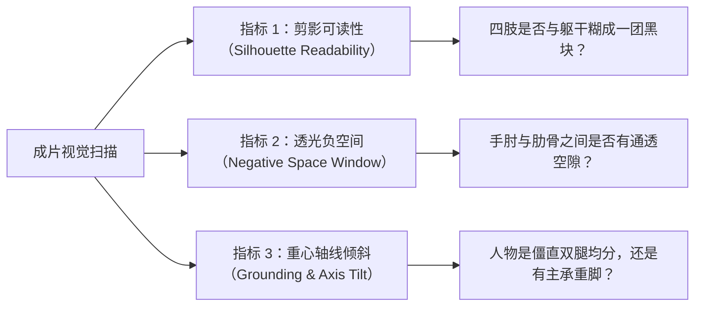

# 《为什么人物摆姿势会显得拘谨、缩成一团或缺乏力量？》
——真人 Cosplay 与人像实战中的重心力学、负空间救赎与角色张力调试

> **作者**：Antigravity 独立摄影教学研究室
> **适用对象**：具备实拍经验、主攻 Cosplay / 漫展场照 / 创作人像、渴望摆脱“死记姿势模板”建立独立现场判断力的摄影爱好者。
> **前置阅读**：已掌握基础光圈快门与焦段透视常识。

---

## 0. 引言：现场最常见的挫败

你一定经历过这样的现场困境：
- 面前的 Cosplayer 服化道极其精致，人物本身长相与身材也非常出众；
- 但当你举起相机按下快门后回放屏幕，却发现照片里的角色**“气场全无”**：整个人看起来畏畏缩缩、缩成一团；
- 手臂仿佛紧紧贴在身上，腰身显得格外臃肿宽大；双腿笔直地戳在地上，像一个正在罚站的木偶；
- 手里明明拿着一把帅气的长剑或大口径枪械，却被拿成了一根塑料扫帚，毫无战斗的张力与重量感；
- 这时，许多摄影师脱口而出的一句话通常是：“*你自然一点，霸气一点！*”或者“*别紧张，放松！*”
- **结果适得其反**：模特听到这些抽象的评价词之后更加无所适从，肌肉愈发僵硬，整场拍摄彻底陷入尴尬的停滞。

问题究竟出在哪里？
**问题从来不是模特“不够专业”或“不够自然”，而是摄影师缺乏一套从人体解剖力学、相机二维投影到角色戏剧张力的系统性诊断与翻译能力。**

在本章中，我们将抛弃所有廉价的“九大显瘦站姿口诀”，直接深入专业人像大师（Roberto Valenzuela、Peter Hurley）与职业 Cosplay 动作指导的核心系统，彻底拆解人物“拘谨、缩紧与无力”的真正成因，并提供可在实战现场立竿见影的纠偏工程。

---

## 1. 视觉诊断：如何从成片一眼看出姿态的“三大硬伤”

在按下快门前或现场回看成片时，不需要逐个检查模特的每根手指，你只需要在 1 秒钟内完成以下**三大视觉指标的扫描**：



### 硬伤一：负空间完全塌陷（Negative Space Collapse）
- **现象**：大臂内侧紧紧贴在肋骨两侧，双手收拢在胸腹部前方。
- **视觉结果**：人体原本由“胸腔宽-腰部收窄-髋部放宽”构成的沙漏型或倒三角型曲线被彻底抹平。大臂在二维投影中与侧腰融为一体，整个人横向视觉轮廓被显著拓宽成一整块平直的肉色或布料，腰部内收弧线完全消失，观感沉重且拘谨。

### 硬伤二：剪影轮廓黏连（Muddled Silhouette）
- **现象**：无论模特在三维空间中摆出了多么复杂的动作，如果从相机镜头这个单一观察点看过去，四肢的线条都重叠在躯干的主轮廓内部，没有向外延伸的几何结构。
- **视觉结果**：照片一旦转换为纯黑剪影，观者完全无法分辨角色是在拔剑、防卫还是仅仅在插兜。

### 硬伤三：地基悬浮或均分（Floating / Symmetrical Grounding）
- **现象**：双脚并拢或平行站立，两腿平均承受身体重量，双肩水平、双髋水平，整条脊柱呈一根垂直竖线。
- **视觉结果**：人体缺乏重力感（Grounding），没有动态的扭转力矩，呈现出呆板僵硬的“兵马俑站姿”。

---

## 2. 力学与解剖机理：为什么身体会自动“缩成一团”？

### 2.1 被动常态习惯与镜头前空间失察
人在没有受到专门镜头训练时，站立状态往往处于“肌肉做功最少”的被动懈怠姿态：**双肩自然前倾内扣、手肘随重力自然贴附肋骨、双脚均分体重**。同时，当直面镜头时，被摄者往往缺乏“相机视点是二维单一投影面”的空间感知，误以为只要手做出了动作即可，却未意识到手臂一旦贴紧身体，在画面中就会被拍扁成一团。此外，面对陌生拍摄者与众目睽睽时的拘谨，也会使人本能地收缩核心以寻求安全感。

### 2.2 大臂贴紧躯干的双重挤压物理灾难（The Arm-Squish Catastrophe）
Roberto Valenzuela 在《Picture Perfect Posing》中反复告诫摄影师：**永远不要让大臂压紧躯干**。
这里存在着严密的物理与光学规律：
1. **肌肉形变（Muscle Flattening）**：大臂上部的三头肌和脂肪是柔软的组织。当手臂自然下垂压紧胸廓时，柔软的肌肉被坚硬的肋骨向外侧挤扁。这就像把一个面团压在桌面上一样，大臂的外轮廓必然向画面外侧扩张，在视觉上直接增粗且松垮；
2. **腰线遮蔽（Waist Obliteration）**：人体的腰身最细处位于肋骨下缘与骨盆之间。而大臂贴紧时，手肘与上臂恰好严严实实地堵在这个凹陷处，让原本立体的腰线彻底变为一堵平直的“肉墙”。

### 2.3 正对镜头的“门板效应”与对称陷阱
当人体躯干轴线与相机镜头光轴呈 90 度垂直正对时，相机记录的是人体横截面积最大的投影面。双肩同宽、双髋同宽，缺乏任何透视纵深（Z轴信息丢失）。同时，左右完全对称的肢体布局会触发人脑的“人工摆拍感”警觉，显得极度做作且机械。

---

## 3. 动作重构工程：三步解决局促感与缺乏力量

要想彻底解决拘谨与无力，摄影师必须掌握一套自下而上的重构工程：**地基（重心） -> 骨架（负空间与侧转） -> 四肢（折角与轻触）**。

### 第一步：重塑地基——单腿主承重与步幅分叉（Contrapposto 原理）

古希腊雕塑大师早在公元前 5 世纪就发现了人体最优雅且具力量感的姿态规律——**对立平衡（Contrapposto）**。

```
【对立平衡力学链条（静止站姿经验法则）】：
1. 将绝大部分重心（约 70%~90%）转移到其中一条腿（后腿或承重腿）；
2. 承重侧的髋部自然向上抬高并向外侧顶出；
3. 非承重腿（轻腿）膝盖微屈，脚尖轻点地面，承担平衡作用；
4. 为了维持身体重心平衡，脊柱自动形成柔和的 S 弯；
5. 肩线朝向承重髋的相反方向倾斜（即：高髋侧对应低肩，低髋侧对应高肩）！
```

*注意：这属于静止/微动人像站姿的经验启发（Heuristic），不可机械当成“所有姿势必须严格 90/10 分布”。在战斗动态、宽弓步或迎击架势中，两腿往往保持约 60/40 或 70/30 的张力对拉，后腿承担强力后蹬势能。*

这一力学链条一旦启动，人物原本僵直垂直的脊柱瞬间被激活，身体立刻拥有了内在张力与节奏感。

#### 战斗力量感进阶：宽弓步与重心下沉（Wide Stride & Low Center of Gravity）
在表现持武器或高战力角色时，若仅仅使用普通人像的单腿站立，往往会显得飘忽无力。此时的法则是：
- **拉开前后脚距（前后步幅分叉）**，将双脚站距拉宽至 1.5 倍肩宽；
- **双膝微屈，重心主动向下压低 5~10 公分**；
- 此时身体的力矩大幅增加，稳如磐石的地基让接下来任何手持长刀、重枪的动作都具备了真实可信的物理支撑！若配合武器剑尖点地，更能构建稳固的三点三角支撑面。

---

### 第二步：解救轮廓——三角负空间（Negative Space Window）的建立

这是本章**最核心、见效最快**的专业技法。

#### 核心法则：手肘与腰侧分离（Negative Space Window Heuristic）
在任何站姿、坐姿或持物姿态中，**主动要求模特将手肘（Elbow）向外拉离躯干，保持透光间隙（通常为两指宽到一拳宽左右，具体视袖型蓬松度而定）**。

#### 产生的可见改变：
1. **大臂压力解除**：上臂肌肉不再被肋骨挤压，恢复紧致自然的垂直截面；
2. **重见天日的天使负空间（Negative Space Triangle）**：在手臂内侧、手肘、腰线与髋骨之间，重新形成了一个通透、透光的三角形几何空隙；
3. **腰线轮廓瞬间清晰**：透过这个透光三角，相机的背景光线能够完整勾勒出人物腰部的内收曲线，身形挺拔舒展！

---

### 第三步：四肢与末梢——避免僵直死锁与羽毛轻触

#### 1. 关节抗僵直原则（Avoid Involuntary Joint Locking）
- 在日常人像与持物准备动作中，完全绷紧锁死的直肘或直膝容易传递出“惊恐、机械与紧绷”；
- 除非角色动作本身要求刚性刺杀或蹬腿发力，一般建议大臂与小臂之间、腿部关节之间保持自然的微曲弹性，避免关节超伸（Hyperextension）带来的生硬感；
- 这一建议是**防范无意识肌肉死锁的操作准则**，而非“所有关节必须用量角器量出 15 度”。当角色执行凌空突刺、立剑接地时，手臂或后腿完全可以呈饱满直线。

#### 2. 羽毛轻触法则（Feather Touch）
- 观察手在触碰脸颊、下巴、领口、武器时的状态；
- 如果模特的指节泛白、脸颊或锁骨处被按出了凹陷，这是典型的“用力过猛”；
- **正确的做法是“悬浮轻触”**：手指像一片羽毛一样仅仅贴在皮肤或道具表面，手部肌肉完全处于松弛状态，指尖呈现自然的阶梯式微屈。

---

## 4. 实拍实战案例图解与解剖拆解

以下结合我们参考库中真实拍摄的典型案例，逐一对比专业摄影师在实战中是如何运用上述原理的。

---

### 案例 1：基准站姿九宫格——重心与侧转身位的系统对照
- **素材来源**：`images/cos-0001.webp`（1080 × 1440 WebP）
- **拍摄场景**：棚拍全身标准参考，包含 9 种基础站姿变体。


#### 专业解剖与教学解析：
1. **对比正中格与四角格**：
   - 当人物完全正对相机且双腿并立时，无论表情如何变化，整体轮廓都显得扁平呆板；
   - 观察表现最舒展的几个格子（如右下、中左）：模特无一例外地采用了**躯干侧转 30°~45°**，并且**一只脚向前跨出半步交叉点地，将重心全部分配在后腿**；
2. **负空间的巧妙留白**：
   - 模特的手无论放在腰际还是轻搭胸前，其大臂与腋下均保留了清晰的通透缝隙，绝对没有贴死身体，使制服的修身腰线展露无遗。

---

### 案例 2：科幻冷感单腿支撑——靠墙倚靠与负空间救赎
- **素材来源**：`images/cos-0005.webp`（1080 × 1402 WebP，Lucy 霓虹廊道）
- **拍摄场景**：夜景霓虹廊道，单腿承重靠阶梯站姿。


#### 专业解剖与教学解析：
1. **重心的绝对稳定**：
   - 模特将全部承重交由右侧直腿，左腿屈起踏在台阶上形成坚实的支点；
   - 这种姿态从根本上消除了“不知如何站立”的尴尬感，使身体拥有极强的空间着地感（Grounded）；
2. **大臂与剪影**：
   - 手臂顺着躯干自然展开，但肘部微微外拉，霓虹轮廓光完整勾勒出手臂外侧与腰际的界限，人物在幽暗环境中剪影极为利落，酷劲十足而绝无萎靡之感。

---

### 案例 3：双手持剑宽站姿——战斗动态与力量感的释放
- **素材来源**：`images/cos-0033.webp`（1080 × 1621 WebP，双手持剑）
- **拍摄场景**：室内战斗角色，双手握长剑准备动作。


#### 专业解剖与教学解析：
1. **为什么这个动作充满力量感而非笨重？**
   - **步幅拉开**：双脚间距超过肩宽，重心沉在两腿之间偏前侧；
   - **核心反拧**：髋部朝向画面左前方，而双肩与剑锋向画面右前方拧转，腰部的扭力通过服装褶皱清晰传递出剧烈张力；
2. **手肘的攻击性几何三角形**：
   - 双手握剑柄时，双肘不是夹紧在胸前，而是**向左右两侧张开形成极具攻击性的锐角三角形**；
   - 剑身作为强有力的对角线贯穿画面，人物的手臂与武器连成一体，力量感呼之欲出。

---

### 案例 4：宽弓步举剑攻击预备——消除“拿塑料玩具”的悬浮感
- **素材来源**：`images/cos-0041.webp`（1080 × 1620 WebP，宽弓步持剑）
- **拍摄场景**：大范围步幅与长剑架势。


#### 专业解剖与教学解析：
1. **解决武器无力感的核心**：
   - 很多摄影师拍持剑动作时，模特两脚并立直直站着举剑，看起来就像握着一根轻飘飘的塑料棒；
   - 本片中，摄影师要求模特做出深弓步，前腿弓、后腿绷，上半身顺势前倾；剑身借由重心的前倾得到了“势能”的加持，剑的重量与杀气立刻在照片中成真。

---

## 5. 角色表达对齐：绝不要盲目追求“标准模特站姿”

摄影师必须警惕一种教条主义倾向：**把所有角色都摆成时尚杂志的优雅名模**。

在 Cosplay 与角色肖像中，动作的合理性必须永远锚定在**角色的戏剧性格与当前情节状态**：

| 角色类型 / 戏剧状态 | 重心与步态特征 | 负空间与手臂开合 | 头颈与眼神朝向 | 禁忌与反面典型 |
| :--- | :--- | :--- | :--- | :--- |
| **霸气 / 刺客 / 战力天花板**（如：Saber, 2B, 散兵） | 宽步幅、低重心、下沉稳定、单脚蹬地 | 手臂主动向外张开，制造大三角形负空间，武器向外延伸 | 下颌微收前伸（Turtle），眼神锐利聚焦，头稍偏向低肩 | 禁忌：并腿内八字、大臂夹胸、娇羞侧头（瞬间破坏威慑力）。 |
| **内敛 / 弱气 / 受伤防备**（如：绫波丽、面码） | 窄步幅、重心偏后缩、双膝可轻微内扣 | 允许大臂适度收拢，手轻触胸口或护住核心，呈现防卫性负空间 | 头向支撑肩轻倚，眼神游离或微低视线，下颌放松 | 禁忌：过度宽站大开大合、耸肩生硬、硬插腰摆冷酷脸。 |
| **高贵 / 冷傲 / 审视者**（如：女帝、雷电将军） | 极端的 Contrapposto 单腿高承重，脊柱极度拔高拉直 | 单手叉腰（肘尖向外形成锐角），另一手优雅下垂或持扇 | 下颌微扬（昂首），视线居高临下微俯视观者 | 禁忌：前倾驼背、双脚均分站军姿、双手无措下垂。 |

**重要判断原则**：如果一个弱气内向的角色身体微微收拢，这种“局促”是**符合角色叙事的真实表达**；但如果一个原本狂傲的大将因为大臂贴紧肋骨而显得缩手缩脚，那就是必须立即纠正的**纯粹摄影失误**！

---

## 6. 现场指挥口令工程：从“无效情绪评判”到“精准解剖指令”

在拍摄现场，语言是摄影师最直接的雕刻刀。低效的沟通不仅浪费时间，更会彻底摧毁模特的自信心。

### 6.1 绝对禁用的“四毒口令”
1. ❌ “*你自然一点！*”（模特内心：我怎么知道怎样算自然？）
2. ❌ “*别那么僵硬，放松！*”（模特内心：完了，我真的很僵，我该怎么办？）
3. ❌ “*霸气一点，拿出你的气场！*”（过于抽象，模特只能机械地死瞪眼睛或龇牙咧嘴）
4. ❌ “*手别不知道放哪，随便摆摆！*”（随便摆摆通常就是最糟糕的动作）

### 6.2 高效口令的黄金语法结构

$$ \text{高效指令} = \text{动词} + \text{具体身体部位} + \text{相对方位} + \text{物理参照物/距离} $$

| 常见问题 | 错误口令 | **大师级现场执行口令** | 原理与预期效果 |
| :--- | :--- | :--- | :--- |
| 大臂夹紧躯干，腰身被吞噬 | “手别贴着，显胖。” | **“右手肘向外推开大概一拳的距离，让腰侧透点光出来。”** | 建立三角负空间，大臂肌肉卸力，腰线显露。 |
| 双腿并立，站姿像站军姿 | “站自然点，动一动。” | **“把重心全部踩在右脚后跟上，左脚往斜前方挪半步，脚尖轻点地。”** | 激活对立平衡（Contrapposto），脊柱出现自然曲度。 |
| 持武器无力，像拿塑料管 | “你拿武器用力点，霸气点！” | **“两脚打开比肩膀宽一点，膝盖稍微蹲下一指深，右手像握小鸟一样轻扶剑柄，剑尖往我镜头右下角压。”** | 重心下沉建立地基，消除死捏指白，武器形成纵深透视。 |
| 机械收下巴挤出双下巴 | “低头收下巴！” | **“耳朵往天花板方向拔高一点，下巴往我的镜头方向伸出两厘米，眼神继续看我。”** | 乌龟伸颈法（Turtle），拉长颈部线条，刻出下颌锐利轮廓。 |
| 双手空悬不知道放哪 | “手随便做个动作。” | **“右手去整理一下右侧的领针（或假发鬓角），指尖轻轻搭住，不要按下去。”** | 赋予真实动作任务（Task），手指处于悬浮轻触状态。 |

---

## 7. 边界与副作用警示：哪些调整不可过度？

任何优秀的摄影技法一旦被极端化，都会走向其反面。现场应用时必须警惕以下**四大副作用与验证边界**：

1. **手肘过度外推的“大鹏展翅”**：
   - *风险*：盲目追求负空间，要求模特手肘向外猛抬，结果像一只张开翅膀的大鸟，或者显得极度凶悍滑稽；
   - *校准*：手肘离开肋骨 **3 至 8 厘米（两指到一拳）** 足矣，只要有一线光透出即可，切勿抬成横向直角。
2. **下颌过度前伸的“探头龟体态”**：
   - *风险*：在非正侧面或半侧面机位下，如果要求模特下巴过度前伸，会导致背部隆起、颈部前倾犹如驼背；
   - *校准*：仅需耳垂微离肩膀、下巴水平微推 1~2 厘米；若相机处于 90 度纯侧面时需极其克制。
3. **躯干侧转过度遮挡服装重要纹样**：
   - *风险*：为了追求显瘦而让模特侧转 60 度以上，结果 Cosplay 服装胸口的核心家族徽章、刺绣或立体配饰被完全转到画外；
   - *校准*：在安排躯干转向前，先向扮演者确认：“*这套衣服今天最希望展示的细节在正面还是侧面？*”根据服装重点微调侧转角度。
4. **假发长度与厚度对头颈动作的物理限制**：
   - *风险*：重型造型假发（如长马尾、厚发髻）重量可达 1~2 公斤，强行要求模特大幅度偏头可能导致假发滑脱或颈部肌肉痉挛拉伤；
   - *校准*：严格遵守“活动极限前置检查”，以身体整体微侧代替极限扭头。

---

## 8. 本章自检与落地实操训练（Action Checklist）

下次当你踏入摄影棚或漫展现场时，请在胸中默念以下**三步调姿口诀**：

- [ ] **1. 看地基**：双腿承重分开了吗？是否已经有一条明确的承重腿？步幅是否能支撑当前的武器与气场？
- [ ] **2. 查负空间**：手肘离开腰侧透光了吗？衣服与手臂间是否留有剪影三角形？
- [ ] **3. 顺末梢**：手部是指尖轻触还是死死紧扣？下巴是向前延伸还是向内挤压？
- [ ] **4. 换口令**：我刚刚说的是“抽象的霸气”，还是“具体的脚跟、手肘与方向”？
